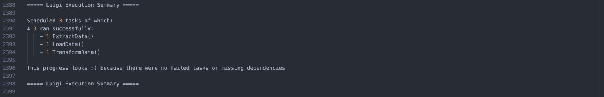
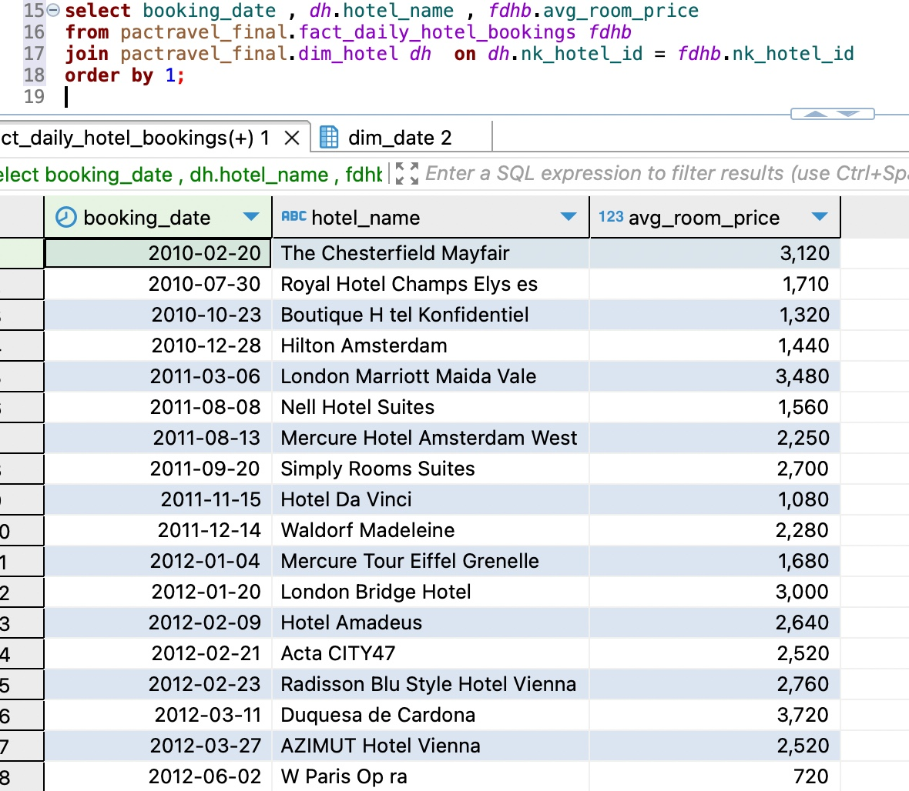

# Building ELT Pipeline for Pactravel Data Warehouse

This project was created as part of the assignment from Pacmann.ai. In this project, I act as a data engineer responsible for building an ELT pipeline for a travel booking platform, PacTravel. In this scenario, PacTravel wants to build a Data Warehouse to support its growing analytical needs, specifically to track daily booking volumes and monitor average ticket prices over time. In this repository, I will focus on developing the ELT pipeline.

---

## 1. Requirements

* **OS** :
  + Linux
  + WSL (Windows Subsystem For Linux)
  + macOS

* **Tools** :
  + DBeaver
  + Docker
  + Cron

* **Programming Language** :
  + Python
  + SQL

* **Python Library** :
  + Luigi
  + Pandas
  + SQLAlchemy
  + python-dotenv

* **Transformation** :
  + dbt (data build tool)
  + dbt-utils
  + dbt-date
  + dbt-constraints

---

## 2. Architecture


### Data Warehouse Design

The warehouse uses a **star schema** dimensional model with:

**Dimension Tables**
| Table | SCD Type | Description |
|---|---|---|
| dim_date | Static | Date dimension seeded via dbt |
| dim_customers | Type 2 | Customer details |
| dim_hotel | Type 2 | Hotel details |
| dim_airlines | Type 1 | Airline details |
| dim_aircrafts | Type 1 | Aircraft details |
| dim_airports | Type 1 | Airport details |

**Fact Tables**
| Table | Type | Description |
|---|---|---|
| fact_flight_bookings | Transaction Fact | One row per individual flight booking |
| fact_hotel_bookings | Transaction Fact | One row per individual hotel booking |
| fact_daily_flight_bookings | Periodic Snapshot | Daily aggregated flight booking per airline |
| fact_daily_hotel_bookings | Periodic Snapshot | Daily aggregated hotel booking per hotel |

---

## 3. Preparations


* **Create and activate virtual environment** :

  ```bash
  python -m venv venv
  source venv/bin/activate
  ```

* **Install requirements** :

  ```bash
  pip install -r requirements.txt
  ```

* **Create `.env` file** in project root directory :

  ```
  # Source DB 
  SRC_POSTGRES_DB=...
  SRC_POSTGRES_HOST=...
  SRC_POSTGRES_USER=...
  SRC_POSTGRES_PASSWORD=...
  SRC_POSTGRES_PORT=...

  # DWH DB
  DWH_POSTGRES_DB=...
  DWH_POSTGRES_HOST=...
  DWH_POSTGRES_USER=...
  DWH_POSTGRES_PASSWORD=...
  DWH_POSTGRES_PORT=...

  # Directory
  DIR_ROOT_PROJECT=...     # <project_dir>
  DIR_TEMP_LOG=...         # <project_dir>/pipeline/temp/log
  DIR_TEMP_DATA=...        # <project_dir>/pipeline/temp/data
  DIR_LOAD_QUERY=...       # <project_dir>/pipeline/src_query/load
  DIR_LOG=...              # <project_dir>/logs/
  DIR_DBT_TRANSFORM=...    # <project_dir>/pactravel_dbt_
  ```

* **Configure and run Docker** :

  ```bash
  docker compose up -d
  ```

---

## 4. Building the Pipeline

### Create Schema for the Database

Create schemas, tables, and attributes based on the dimensional model design:
+ [Source database schema](./helper/source_init/init.sql)
+ Target database:
[Staging schema (pactravel)](./helper/dwh_init/dwh-staging-schema.sql)

### Create Utility Functions

Then i created some utility functions to support the orchestration, such as:
+ [Database connector](./pipeline/utils/db_connect.py) : Functions to connect to source and DWH databases.
+ [SQL file reader](./pipeline/utils/read_sql.py) : Function to read SQL query files and return as strings.
+ [Delete temporary data](./pipeline/utils/delete_temp_data.py) : Function to delete temporary data.

### Create ELT Tasks with Luigi

**[ExtractData](./pipeline/extract.py)**

The ExtractData task extracts all tables from the PacTravel source database (aircrafts, airlines, airports, customers, hotel, flight_bookings, hotel_bookings) and saves them as temporary CSV files. The output of this task are CSV files for each table, a task summary with status and execution time, and a log file.

**[LoadData](./pipeline/load.py)**

The LoadData task loads the extracted CSV files into the DWH pactravel staging schema without modifications. Before loading, all tables are truncated to ensure no duplicate data. The outputs of this task are a task summary and a log file.

**[TransformData](./pipeline/transform.py)**

The TransformData task runs dbt to transform data from the staging schema into the final dimensional model. It executes dbt deps, dbt seed, dbt run, dbt snapshot, and dbt test sequentially. The outputs of this task are also a task summary and a log file.

### Compile Tasks

All tasks are compiled into a main script:

```bash
python elt_main.py
```

Example output logs:

**Logs**



---

## 5. Results

After running the full pipeline, this is the example query used on the fact_daily_hotel_bookings:

**Sample Query — Daily Hotel Average Price**
```sql
select booking_date , dh.hotel_name , fdhb.avg_room_price 
from pactravel_final.fact_daily_hotel_bookings fdhb
join pactravel_final.dim_hotel dh  on dh.nk_hotel_id = fdhb.nk_hotel_id 
order by 1;
```


---

## 6. Conclusion

This project was created as part of the assignment for Pacmann.ai. through this project, i learned hands on experience in designing a dimensional data warehouse, building ELT pipeline using Python, orcheration using Luigi, and transformation using dbt, and the most important is understanding the business problems into a solutions. For the full story, you can check my medium article. Feel free to connect on [Linkedin](https://www.linkedin.com/in/adila-zahra-faradisa/)
